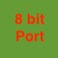

# 8-Bit Port

Rozšírenie pre blokové programovanie na posielanie bajtov cez výstupné porty Micro:bitu.

## Bloky

### Send Byte
Pošle zadaný bajt (0-255) na zadané výstupné porty.

- **Data**: Číselný parameter obsahujúci hodnotu bajtu (0-255).
- **D7 až D0**: Výstupné digitálne porty Micro:bitu, ktoré budú použité na odoslanie jednotlivých bitov.

```markdown

